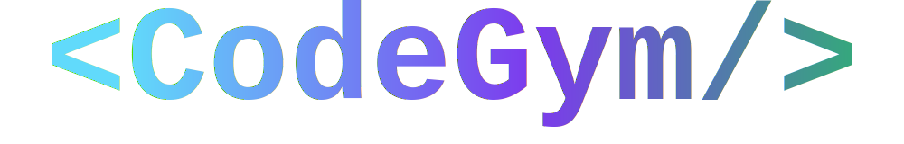
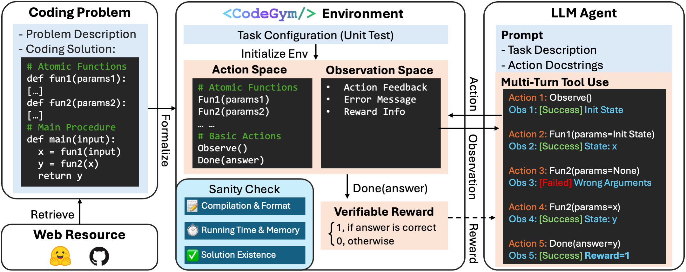
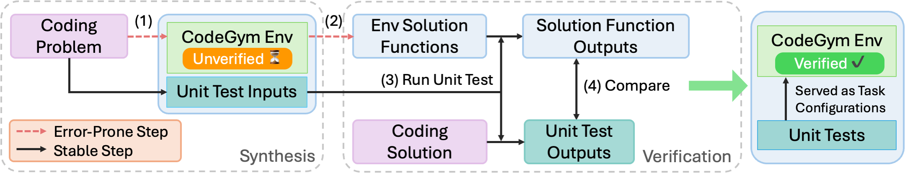

<p align="center">
  
</p>

# Generalizable End-to-End Tool-Use RL with Synthetic CodeGym

<p align="center">
  <a href="https://creativecommons.org/licenses/by-nc/4.0/"></a>
  <a href="https://arxiv.org/abs/2509.17325"></a>
</p>

> **Weihua Du, Hailei Gong, Zhan Ling, Kang Liu, Lingfeng Shen, Xuesong Yao, Yufei Xu, Dingyuan Shi, Yiming Yang, Jiecao Chen**  
> ["Generalizable End-to-End Tool-Use RL with Synthetic CodeGym" (2025)](https://arxiv.org/abs/2509.17325)

CodeGym is a synthetic environment generation framework for LLM agent reinforcement learning on tool-use tasks. It automatically converts static code problems into interactive CodeGym environments where agents can learn to use tools to solve complex tasks in various configurations.

## TODO

> 🚀 Coming Soon: We will release the following components for the project. Stay tuned for updates!

- [x] Release the generation pipeline
- [ ] Release the CodeGym dataset
- [ ] Release the environment server

## Overview

<p align="center">
  
</p>

CodeGym transforms traditional code problems into interactive environments where LLM agents can learn to:
- Use tools and actions to solve problems step-by-step
- Learn generalizable tool-use behaviors

## Environment Synthesis Process

<p align="center">
  
</p>

We designed an elaborate process for CodeGym environment synthesis and verification:

**Gym Synthesis:**
- Extract reusable code logic and functions from programming solutions
- Convert them into a library of documented tools and utilities
- Generate OpenAI Gym format environments with state, actions, transitions, and rewards

**Gym Verification:**
- Generate comprehensive unit tests spanning multiple difficulty levels
- Validate environment correctness (no compilation errors, timeouts, or memory issues)
- Verify solvability by generating solution functions that successfully use the provided tools

## Examples

The `example/` folder contains sample CodeGym environments to help you get started:
- `example/example_envs` contains some CodeGym environments examples
- `example/training_instance.jsonl` contains some instances for RL training
- `example/raw_problems.jsonl` contains some raw coding problems for generation pipeline demonstration

## Key Result

By training in CodeGym, LLMs show stronger generalization on out-of-distribution (OOD) tool-use and multi-turn benchmarks:

<p align="center">
  
</p>

## CodeGym Synthesis Pipeline

We release the pipeline for environment synthesis and verification. Please refer to `gym/README.md` for details.

## License

This project and dataset are released under the [Creative Commons Attribution-NonCommercial 4.0 International (CC BY-NC 4.0)](https://creativecommons.org/licenses/by-nc/4.0/) license.

## Citation

If you find this work useful, please cite our paper:

```bibtex
@misc{du2025generalizableendtoendtooluserl,
      title={Generalizable End-to-End Tool-Use RL with Synthetic CodeGym}, 
      author={Weihua Du and Hailei Gong and Zhan Ling and Kang Liu and Lingfeng Shen and Xuesong Yao and Yufei Xu and Dingyuan Shi and Yiming Yang and Jiecao Chen},
      year={2025},
      eprint={2509.17325},
      archivePrefix={arXiv},
      primaryClass={cs.LG},
      url={https://arxiv.org/abs/2509.17325}, 
}
```
