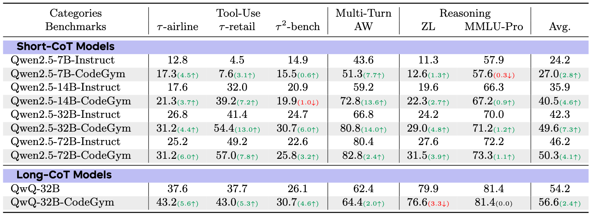

  

# Generalizable End-to-End Tool-Use RL with Synthetic CodeGym

CodeGym is a synthetic environment generation framework for LLM agent reinforcement learning on tool-use tasks. It automatically converts static code problems into interactive CodeGym environments where agents can learn to use tools to solve complex tasks in various configurations.

> 🚀 Coming Soon: We will release the generation pipeline and the CodeGym dataset. Stay tuned for updates!

## Overview

  

CodeGym transforms traditional code problems into interactive environments where LLM agents can learn to:
- Use tools and actions to solve problems step-by-step
- Learn generalizable tool-use behaviors

## Environment Synthesis Process

  

We designed an elaborate process for CodeGym environment synthesis and verification:

**Gym Synthesis:**
- Extract reusable code logic and functions from programming solutions
- Convert them into a library of documented tools and utilities
- Generate OpenAI Gym format environments with state, actions, transitions, and rewards

**Gym Verification:**
- Generate comprehensive unit tests spanning multiple difficulty levels
- Validate environment correctness (no compilation errors, timeouts, or memory issues)
- Verify solvability by generating solution functions that successfully use the provided tools

## Key Result

By training in CodeGym, LLMs show stronger generalization on out-of-distribution (OOD) benchmarks:

  

## License

This project and dataset are released under the [Creative Commons Attribution-NonCommercial 4.0 International (CC BY-NC 4.0)](https://creativecommons.org/licenses/by-nc/4.0/) license.